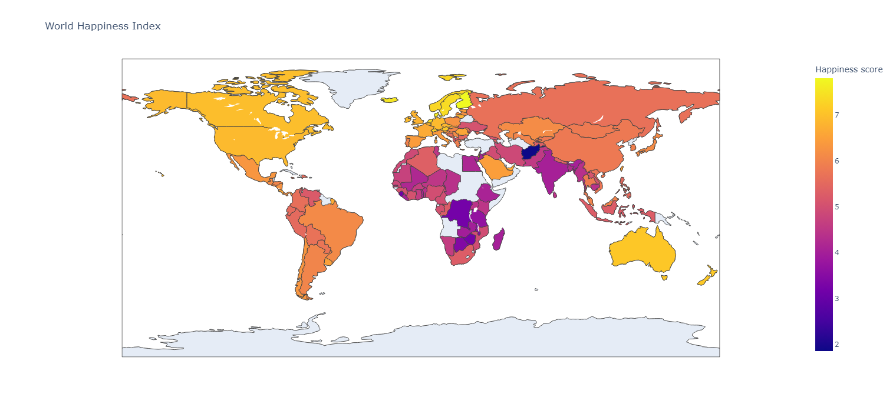

# Exploratory Data Analysis (EDA) in Python: World Happiness Report 2023 

## World Happiness Index Map

In this project, I have created a map plot visualizing the World Happiness Index. The map provides an overview of happiness scores across different countries.

### Description

The map is based on the data from the World Happiness Report 2023 and was generated using *Plotly Express* for the visualization.

### Usage

To view the interactive map plot, simply download the [WHI2023.html]() file in this repository.

